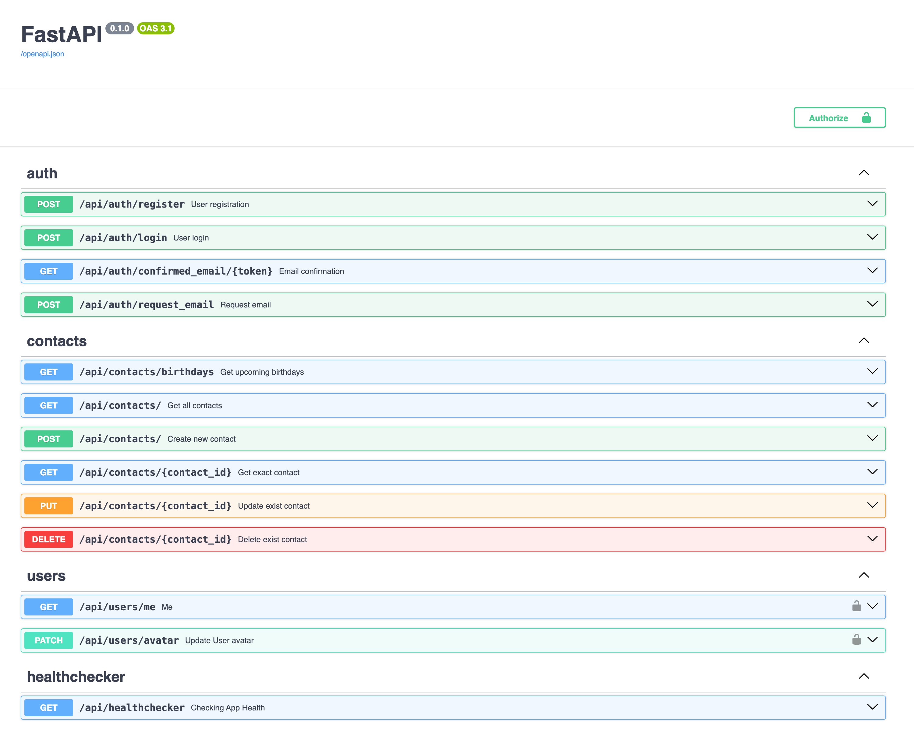

Project must contain .env file with params

```
POSTGRES_DB=postgres
POSTGRES_USER=
POSTGRES_PASSWORD=
POSTGRES_PORT=5432
POSTGRES_HOST=localhost

REDIS_HOST=redis
REDIS_PORT=6379

DB_URL=postgresql+asyncpg://${POSTGRES_USER}:${POSTGRES_PASSWORD}@${POSTGRES_HOST}:${POSTGRES_PORT}/${POSTGRES_DB}
JWT_SECRET=secret_key
JWT_ALGORITHM=HS256
JWT_EXPIRATION_SECONDS=3600

MAIL_USERNAME=screamer916@gmail.com
MAIL_PASSWORD=tbhr lfwh ulku mmzn
MAIL_FROM=screamer916@gmail.com
MAIL_PORT=587
MAIL_SERVER=smtp.gmail.com
MAIL_FROM_NAME=Example email
MAIL_STARTTLS=True
MAIL_SSL_TLS=False
USE_CREDENTIALS=True
VALIDATE_CERTS=True

CLD_NAME=dpehbjbce
CLD_API_KEY=562444567144183
CLD_API_SECRET=wpEBcXH3MU_rA9Sxldg6-cjWIx0
```

To run the application use the following commands

```
docker compose up

poetry install

poetry shell

alembic upgrade head

fastapi dev main.py
```

Access to swagger : http://localhost:8000/docs


